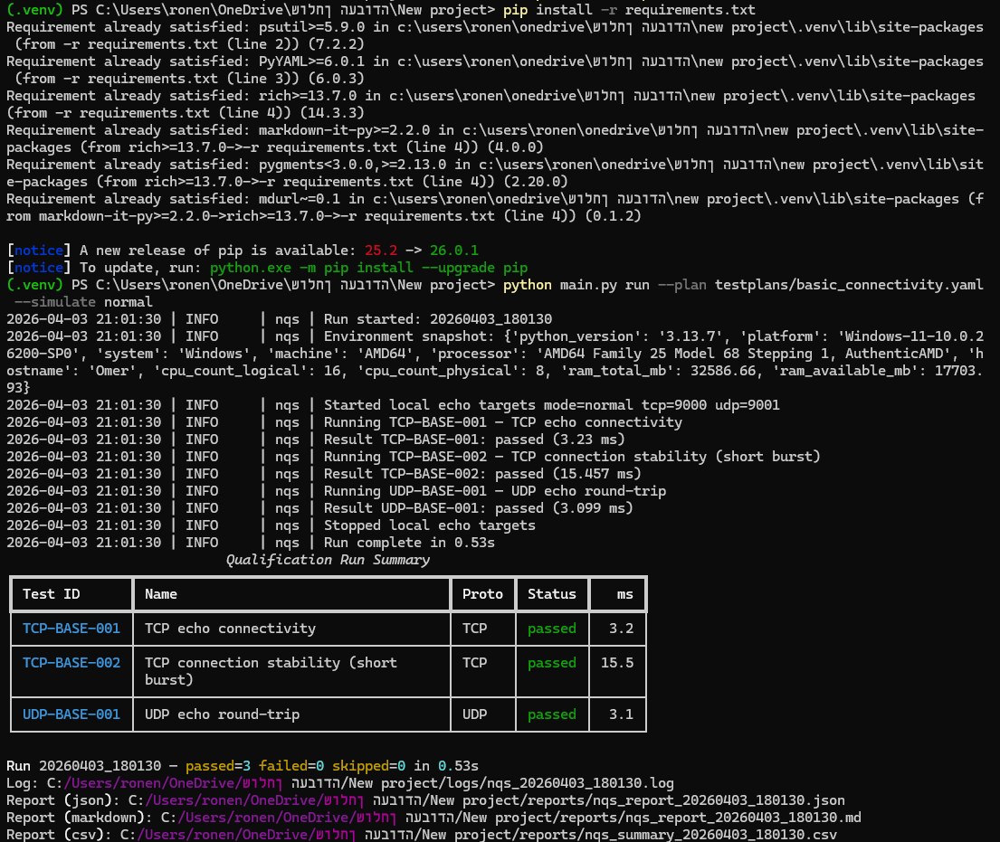
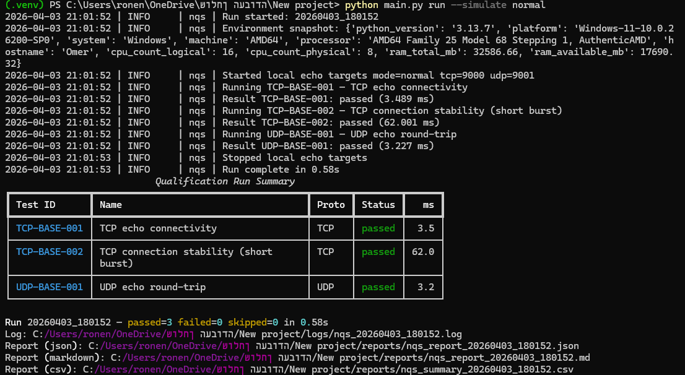
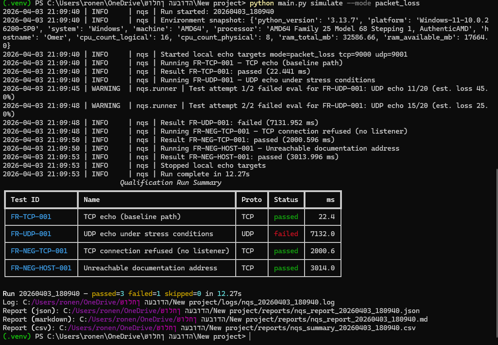

# network-qualification-suite

A **Python-based system and network qualification framework** that models how validation engineers execute test plans in a lab or pre-production environment: structured scenarios, real TCP/UDP checks, logging, reporting, and **failure reproduction** for debugging workflows.

---

## Screenshots







---

## Overview

**network-qualification-suite** loads declarative test plans (YAML/JSON), runs TCP and UDP qualification modules, captures environment context, writes timestamped logs, and produces **Markdown + JSON + CSV** reports. A built-in **local echo target** (TCP/UDP) makes the project runnable immediately on a laptop—no external lab dependency required.

## Motivation

Junior roles in **networking qualification**, **system-level testing**, and **DFT/automation** reward engineers who can:

- Execute repeatable test plans and interpret results
- Debug intermittent or environment-specific failures
- Automate validation and communicate outcomes clearly

This project demonstrates that mindset in a portfolio-friendly, open-source package.

## Features

| Area | What you get |
|------|----------------|
| **Test execution** | YAML/JSON plans, enable/disable cases, TCP & UDP modules, retries |
| **Protocols** | Connectivity, stability bursts, latency-style sampling, UDP loss metrics |
| **Failure simulation** | Delayed responses, packet loss, partial TCP replies, wrong echo, intermittent behavior, TCP “connection refused” mode |
| **Logging** | Console + file, UTC run IDs, machine snapshot (OS, hostname, Python, CPU/RAM via `psutil`) |
| **Reporting** | Polished `.md`, machine-readable `.json`, summary `.csv` |
| **CLI** | `run`, `simulate`, `serve`, `report` via `argparse` |
| **Lab-friendly layout** | Clear `src/` packages; works on **Windows**; paths suit Linux CI or test racks |

## Architecture

```text
network-qualification-suite/
├── main.py                 # CLI entry (adds ./src to PYTHONPATH)
├── requirements.txt
├── testplans/              # Declarative qualification plans
├── logs/                   # Timestamped run logs (gitignored patterns)
├── reports/                # Generated reports (gitignored patterns)
├── docs/                   # Engineering templates
├── unit_tests/             # Stdlib unit tests for utilities
└── src/
    ├── core/               # Loader, schema, engine, runner
    ├── tests/              # TCP/UDP qualification implementations
    ├── simulation/         # Local echo servers + failure modes
    ├── reporting/        # Markdown / JSON / CSV writers
    └── utils/              # Logging, env snapshot, retry/backoff
```

## Setup

**Requirements:** Python 3.10+ recommended.

```powershell
cd "C:\Users\ronen\OneDrive\שולחן העבודה\New project"
python -m venv .venv
.\.venv\Scripts\Activate.ps1
pip install -r requirements.txt
```

On Linux/macOS:

```bash
python3 -m venv .venv
source .venv/bin/activate
pip install -r requirements.txt
```

## Example commands

**Run baseline plan with auto-started local echo (recommended first run):**

```text
python main.py run --plan testplans/basic_connectivity.yaml --simulate normal
```

**Run only TCP tests:**

```text
python main.py run --plan testplans/basic_connectivity.yaml --simulate normal --protocol tcp
```

**Manual two-terminal workflow:**

```text
# Terminal A
python main.py serve --tcp --udp --mode normal

# Terminal B
python main.py run --plan testplans/udp_validation.yaml
```

**Failure reproduction (embedded target in selected mode):**

```text
python main.py simulate --mode packet_loss
python main.py simulate --mode wrong_echo
```

**Show the latest Markdown report in the console:**

```text
python main.py report --latest
```

**Help:**

```text
python main.py --help
python main.py run --help
```

## Sample console output

The CLI uses **Rich** for readable tables (status coloring, aligned columns). After a run you will see a **Qualification Run Summary** table plus paths to `logs/` and `reports/`.

## Sample reports

See `reports/samples/` for example Markdown/JSON outputs (synthetic run IDs may differ from your local runs).

## Why this fits networking qualification & validation roles

This project is framed like **internal lab tooling**:

- **System-level testing mindset:** plans, pass/fail, retries, environment capture, audit trail  
- **Debugging and failure analysis:** simulation modes reproduce delayed, dropped, partial, and malformed traffic  
- **Network protocol understanding:** real TCP connect/send/recv and UDP round-trip semantics  
- **Automation and scripting:** CLI-driven workflows, structured logs, CSV/JSON for dashboards  
- **Test plan execution:** declarative scenarios, filters (`--protocol`), repeatable runs  
- **Reporting and validation workflows:** human + machine outputs for reviews and triage  

It also aligns with **DFT-adjacent** expectations—tooling ownership, automation, and disciplined triage—even though the domain here is **network qualification** rather than silicon test.

## Engineering skills demonstrated

- Structured Python packaging and modular design  
- Socket-level networking (TCP/UDP) with timeouts and negative cases  
- Configuration validation and defensive error handling  
- Logging and multi-format reporting  
- Optional **exponential backoff** retries (`utils/retry.py`)  
- **Environment snapshot** for reproducibility (`utils/env_info.py`)  
- Unit tests for critical helpers (`unit_tests/`)

## Test plans included

| File | Purpose |
|------|---------|
| `testplans/basic_connectivity.yaml` | TCP echo, TCP stability burst, UDP batch echo |
| `testplans/udp_validation.yaml` | UDP latency-style sampling, bulk UDP, closed-port negative |
| `testplans/failure_reproduction.yaml` | Mixed positive/negative checks for `simulate` modes |
| `testplans/minimal.json` | Minimal **JSON** plan (loader parity with YAML) |

Induced failure demos (for example `python main.py simulate --mode packet_loss`) may end with **exit code 1** when UDP echo checks fail — that is expected for qualification-style “detect bad behavior” runs.

## License / use

Portfolio and learning use. Adapt plans and ports for your environment.

---

*Built to read like a junior validation engineer’s “real” tool—not a toy script.*
